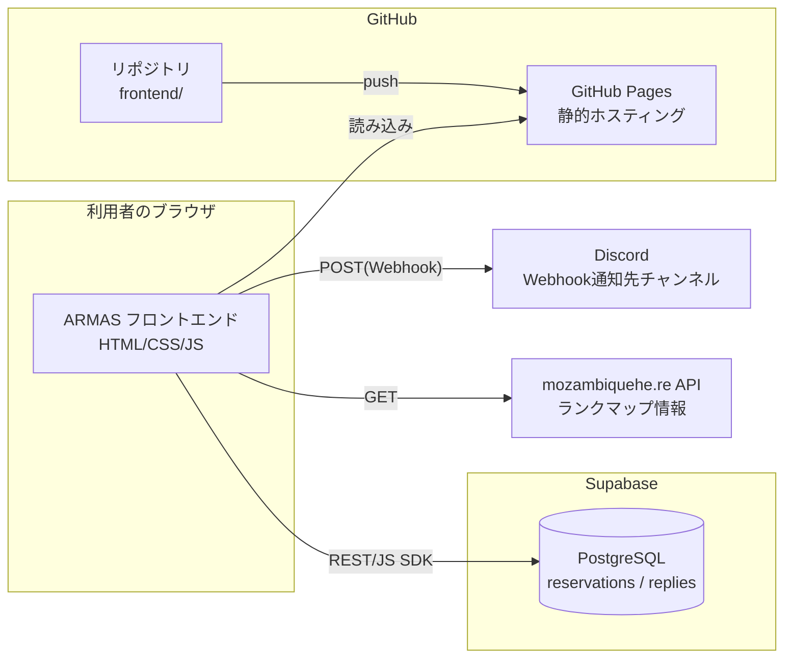
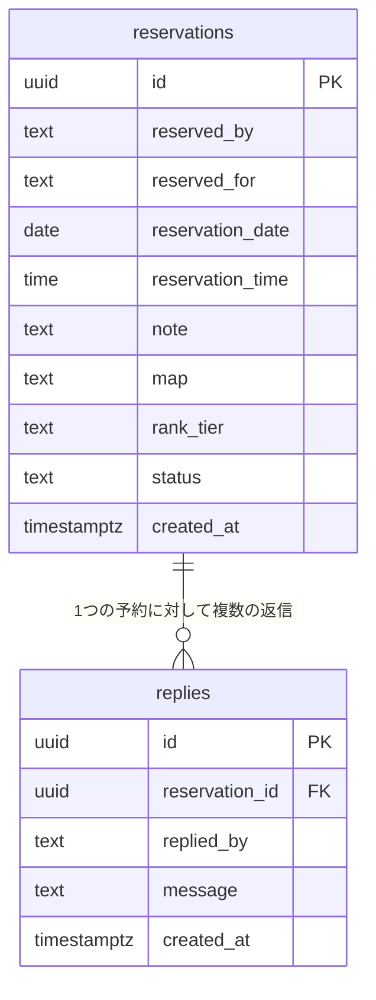

# ARMAS 基本設計書

- システム名: ARMAS（Apex Reservation Management & Alert System）
- 対象バージョン: mknimknijブランチ（2026年時点の最新実装）
- 作成目的: 機能増加に伴う全体像の整理

---

## 1. システム概要

### 1.1 目的
Apex Legendsのランクマッチを一緒にプレイする相手と、日時・ランク帯などの条件をすり合わせて予約するための小規模ツール。予約内容はDiscordに自動通知され、当事者間のやり取り（返信）もアプリ上で完結する。

### 1.2 想定利用者
- 個人〜小規模グループ（身内利用を想定。ユーザー認証機能は持たない）

### 1.3 特徴
- サーバーを持たない静的サイト（GitHub Pages上で動作）
- データは外部DB（Supabase）に保存し、複数端末・複数人からの利用に対応
- Discord Webhookによる自動通知
- Apex Legends非公式API（mozambiquehe.re）によるランクマップ情報の参考表示

---

## 2. 全体構成

### 2.1 構成要素
| 要素 | 役割 |
|---|---|
| フロントエンド（`frontend/`） | 画面表示・入力・DB/外部APIとの通信をすべて担当する静的サイト |
| GitHub Pages | フロントエンドのホスティング先（`main`ブランチpush時に自動デプロイ） |
| Supabase | 予約・返信データを保持する外部DB（無料枠のPostgreSQL） |
| Discord Webhook | 予約・返信・キャンセル発生時の通知先 |
| mozambiquehe.re API | 現在のランクマップ情報を取得するための非公式API（任意設定） |

### 2.2 データの持ち方
| データ種別 | 保存先 | 補足 |
|---|---|---|
| 予約・返信データ | Supabase（`reservations`, `replies`テーブル） | 全利用者で共有される |
| Discord Webhook URL / Apex APIキー | ブラウザのlocalStorage | 端末ごとの個人設定。共有されない |

---

## 3. 機能一覧

| No | 機能カテゴリ | 機能名 | 概要 |
|----|---|---|---|
| 1 | 予約 | カレンダー・時間選択 | 月送りカレンダーと30分単位の時間帯から予約日時を選択する |
| 2 | 予約 | 予約登録 | 予約者名・予約先・ランク・備考を入力し、予約を登録する |
| 3 | 予約 | 重複チェック | 同一日時に既存の有効な予約がある場合、登録前に確認ダイアログを表示する |
| 4 | 予約 | 予約状況のカレンダー表示 | 予約がある日付・時間帯にマークを表示し、事前に埋まり具合を確認できる |
| 5 | 予約 | 予約一覧表示 | 登録済み予約を一覧表示する |
| 6 | 予約 | 予約の編集 | 日付・時刻・予約先・ランク・備考を後から変更できる |
| 7 | 予約 | 予約の削除 | 確認ダイアログを経て予約を削除する |
| 8 | 予約 | フィルタ・検索 | 予約者名・日付範囲で一覧を絞り込む |
| 9 | ステータス | ステータス管理 | 「募集中」「確定」「キャンセル」を手動または自動（返信時）で切り替える |
| 10 | 返信 | 返信機能 | 各予約に対してスレッド形式で返信を残せる |
| 11 | 通知 | 新規予約のDiscord通知 | 予約登録時に内容をDiscordへ自動送信する |
| 12 | 通知 | 返信のDiscord通知 | 返信内容をDiscordへ自動送信する |
| 13 | 通知 | キャンセルのDiscord通知 | ステータスが「キャンセル」になった際にDiscordへ自動送信する |
| 14 | 参考情報 | ランクマップ表示 | 現在・次のランクマップと切り替わりまでの残り時間を表示する（APIキー設定時のみ） |
| 15 | 設定 | 個人設定 | Discord Webhook URL、Apex APIキーを端末ごとに保存する |

---

## 4. 画面構成

| 画面/セクション | 概要 |
|---|---|
| 01 予約フォーム | カレンダー・時間帯選択、予約者/予約先/ランク/備考の入力、予約実行 |
| 02 設定パネル | Discord Webhook URL・Apex APIキーの登録（開閉式） |
| 03 予約一覧 | フィルタ欄＋予約カードのリスト。各カードから返信・編集・削除・ステータス変更が可能 |

---

## 5. データ概要（論理設計）

物理設計（カラムの型・制約・RLSポリシー等）は詳細設計書を参照。

---

## 6. 非機能要件・制約事項

| 項目 | 内容 |
|---|---|
| ホスティング費用 | GitHub Pages・Supabase・mozambiquehe.re APIともに無料枠内で運用 |
| 認証 | ユーザー認証は無し（身内利用前提）。DBへの読み書きはanon keyで許可されている |
| セキュリティ | Supabaseの匿名キーはフロントエンドに埋め込まれる設計。RLSで読み書きを制御しているが、リポジトリをPublicにする場合は第三者も予約データを閲覧・操作できる点に留意 |
| リマインド通知 | 未実装（要件として一旦見送り）。実装する場合はサーバー側の定期実行（Supabase pg_cron等）が必要 |
| 対応環境 | モダンブラウザ（Chrome, Edge等）を想定。IE等の古いブラウザは非対応 |
| データバックアップ | Supabase側の自動バックアップ機能に依存（無料プランでは限定的なため、重要データは適宜CSV等でエクスポート推奨） |

---

## 7. 今後の拡張候補（未実装）
- リマインド通知（要サーバー側スケジューラ）
- 予約者ごと/ランク帯ごとの集計・統計表示
- 予約データのCSVエクスポート
- 簡易PINによる編集・削除の本人確認
- 週次定期予約（繰り返し予約）
