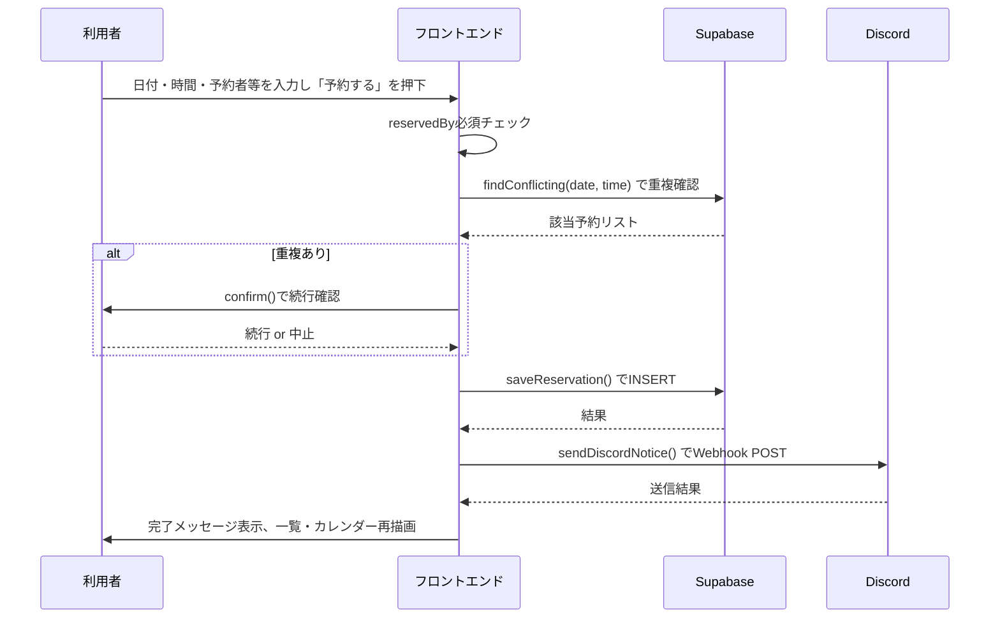
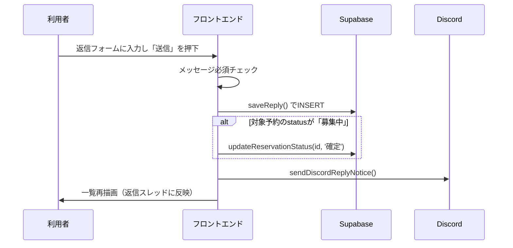
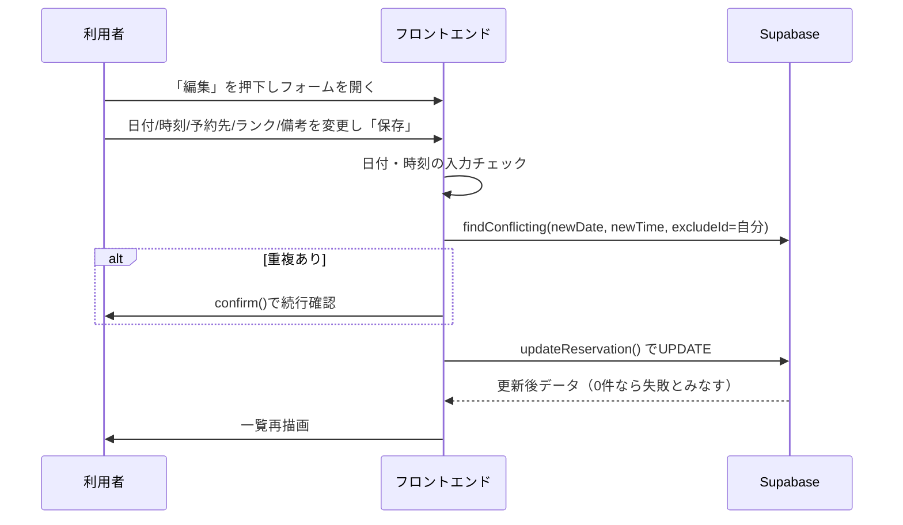
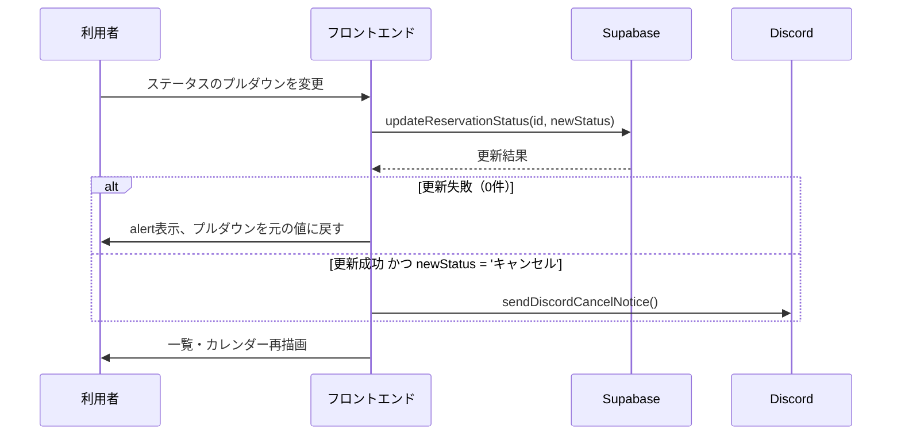
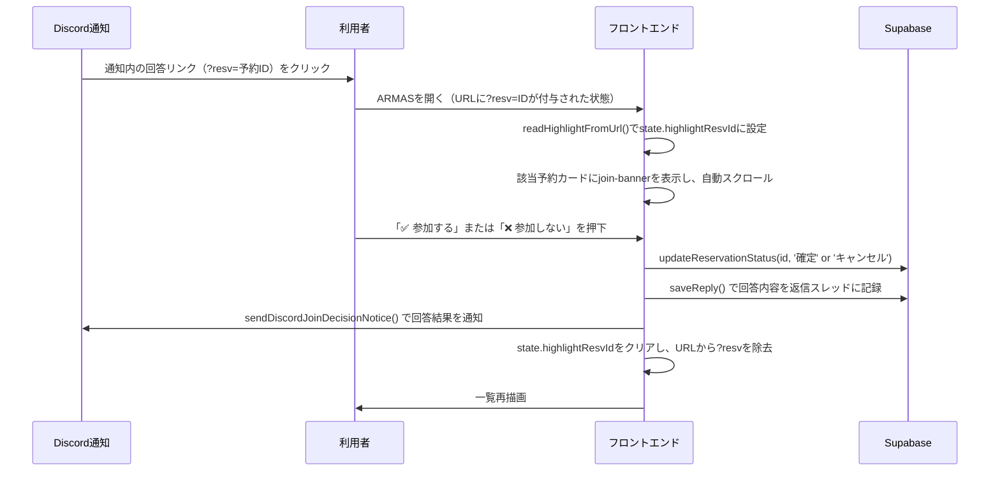
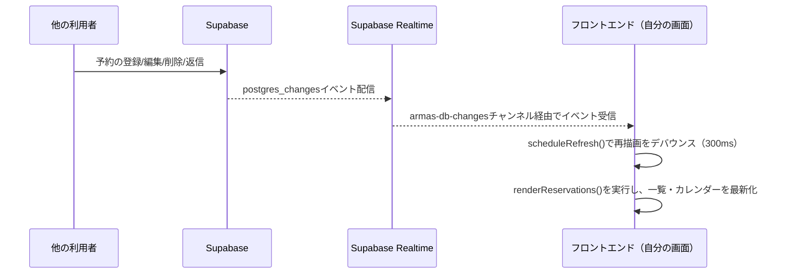
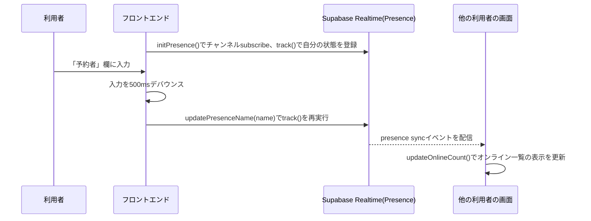

# ARMAS 詳細設計書

基本設計書に対応する詳細仕様。画面項目・データベース定義・処理シーケンス・外部API仕様・関数一覧を記載する。
対象バージョン: v1.4.0

---

## 0. モジュール構成（`frontend/js/`）

v1.3.0でフロントエンドのJavaScriptは機能ごとのESモジュールに分割された。各ファイルはHTML内で明示的に読み込むのではなく、`main.js`を起点にimport/exportで連結される（`<script type="module" src="js/main.js">`）。

| ファイル | 役割 |
|---|---|
| `main.js` | エントリポイント。各モジュールの初期化関数を呼び出す |
| `dom.js` | `$(id)`（`document.getElementById`のショートハンド）を提供 |
| `config.js` | Supabaseクライアント（`sb`）の生成、テーブル名・API定数を定義 |
| `state.js` | 画面・入力状態を保持する`state`オブジェクトを定義 |
| `constants.js` | ランク一覧・ステータス一覧とその選択肢HTML生成関数 |
| `storage.js` | 個人設定（Webhook URL・APIキー）のlocalStorage読み書き |
| `reservationsApi.js` | 予約データのCRUD、重複チェック、カレンダー用データ取得（Supabase呼び出し） |
| `repliesApi.js` | 返信データの取得・保存（Supabase呼び出し） |
| `discordNotify.js` | Discord Webhookへの各種通知メッセージ送信 |
| `mapRotation.js` | ランクマップ情報の取得・表示 |
| `calendarView.js` | カレンダー・時間帯選択UIの描画 |
| `reservationForm.js` | 予約フォームの入力・送信処理 |
| `filters.js` | 予約者名・日付範囲によるフィルタのイベント登録 |
| `reservationsView.js` | 予約一覧の描画、各カードの操作（返信・編集・削除・ステータス変更・参加可否回答） |
| `presence.js` | オンライン人数・名前表示（Supabase Realtime Presence） |
| `realtime.js` | 予約・返信テーブルの変更をリアルタイム購読し、一覧を自動更新 |
| `stats.js` | 履歴・統計ページの集計表示、CSVエクスポート |
| `pages.js` | サイドバーメニューによる画面（予約/統計）切り替え |

---

## 1. 画面詳細仕様

### 1.1 予約フォーム

| 項目ID | 項目名 | 種別 | 必須 | 備考 |
|---|---|---|---|---|
| `calGrid` / `timeGrid` | 日付・時間選択 | カレンダーUI/時間帯ボタン | 必須 | 過去日は選択不可。予約済み日時にはマーク表示 |
| `reservedBy` | 予約者 | テキスト入力 | 必須 | 未入力時はエラーメッセージ表示、登録不可 |
| `reservedFor` | 予約先 | テキスト入力 | 任意 | 相手・宛先を自由記述 |
| `rankTier` | 現在のランク | プルダウン | 任意（未選択時は「Rookie IV」扱い） | Rookie IV 〜 Apex Predatorの28区分 |
| `notes` | 備考 | テキストエリア | 任意 | 自由記述 |
| `reserveBtn` | 予約するボタン | ボタン | - | 日付・時間未選択時は非活性 |
| `reserveStatus` | 処理結果表示 | テキスト | - | 成功/失敗/警告のメッセージを表示 |

#### 入力チェック仕様
1. 日付・時間が未選択の場合、ボタン非活性のため送信不可
2. `reservedBy`が空文字の場合、送信をブロックしメッセージ表示
3. 同一日時に有効（ステータス≠キャンセル）な予約が存在する場合、`confirm()`ダイアログで警告し、キャンセル選択時は登録を中止

### 1.2 設定パネル

| 項目ID | 項目名 | 種別 | 保存先 |
|---|---|---|---|
| `discordWebhook` | Discord Webhook URL | テキスト入力 | localStorage（`armas:settings`） |
| `apexApiKey` | Apex APIキー | テキスト入力 | localStorage（`armas:settings`） |
| `saveSettings` | 保存ボタン | ボタン | - |

APIキー設定時、保存と同時に`fetchMapRotation()`を実行しランクマップ情報を取得する。

### 1.3 予約一覧

| 項目ID | 項目名 | 種別 | 備考 |
|---|---|---|---|
| `filterName` | 予約者名検索 | テキスト入力（インクリメンタル） | 部分一致 |
| `filterFrom` / `filterTo` | 日付範囲 | date入力 | `from <= reservation_date <= to` |
| `filterClear` | クリアボタン | ボタン | フィルタ条件を全リセット |
| 予約カード | - | - | 1予約=1カード。詳細は1.4節 |

### 1.4 予約カードの構成要素

| 要素 | 内容 |
|---|---|
| `join-banner`（Discordリンクから開いた場合のみ表示） | 「✅ 参加する／❌ 参加しない」の2ボタン。回答すると自動でステータス変更・返信記録・Discord再通知を行う |
| ステータスバッジ + `status-select` | 現在のステータス表示、およびプルダウンでの変更 |
| `reply-toggle` / `edit-toggle` / `del` | 返信・編集・削除の各操作ボタン |
| 基本情報表示 | 日時・予約者/予約先・ランク・参考マップ・備考 |
| `edit-form`（開閉式） | 日付・時刻・予約先・ランク・備考を編集するフォーム |
| `replies`（返信スレッド） | 返信者・日時・本文を時系列で表示（常時表示） |
| `reply-form`（開閉式） | 返信者名（任意）・返信本文の入力フォーム |

編集フォームと返信フォームは排他的に開閉する（片方を開くと他方は自動的に閉じる）。

`join-banner`はURLクエリパラメータ`?resv=<予約ID>`が付与された状態でページを開いた場合にのみ、該当する予約カードに表示される。表示対象のカードへは初回描画時に自動スクロールする。

### 1.5 ヘッダー

| 項目ID | 項目名 | 内容 |
|---|---|---|
| `onlineCount` | オンライン表示 | Supabase Realtime Presenceで取得した人数・名前を表示（例: `現在のオンライン（2人）：たろう、匿名`） |
| `settingsToggle` | 設定ボタン | クリックで設定パネル（`settingsPanel`）の開閉をトグル |

### 1.6 サイドバーメニュー

| リンク | 種別 | 遷移先 |
|---|---|---|
| 予約・カレンダー（`data-page-link="reservations"`） | ページ内切り替え | 予約フォーム・予約一覧ページを表示 |
| 履歴・統計（`data-page-link="stats"`） | ページ内切り替え | 履歴・統計ページを表示し、`renderStatsPage()`を実行 |
| Apex Legends 公式サイト | 外部リンク | 新規タブで公式サイトを開く |
| GitHubリポジトリ | 外部リンク | 新規タブでリポジトリを開く |
| 基本設計書 / 詳細設計書 | 外部リンク | 新規タブでGitHub上のMarkdownを開く |

### 1.7 履歴・統計ページ

| 項目ID | 内容 |
|---|---|
| `statsContent` | 予約者別／ランク帯別／ステータス別の件数集計を表示するコンテナ |
| `exportCsvBtn` | 全予約データをCSVファイルとしてダウンロードするボタン（UTF-8 BOM付き、Excelでの文字化け対策済み） |

---

## 2. データベース設計（物理設計）

### 2.1 `reservations` テーブル

| カラム名 | 型 | 制約 | 説明 |
|---|---|---|---|
| id | uuid | PK, default `gen_random_uuid()` | 予約ID |
| reserved_by | text | NOT NULL | 予約者名 |
| reserved_for | text | NULL可 | 予約先（相手・宛先） |
| reservation_date | date | NOT NULL | 予約日 |
| reservation_time | time | NOT NULL | 予約時刻 |
| note | text | NULL可 | 備考 |
| map | text | NULL可 | 予約時点のランクマップ（スナップショット） |
| rank_tier | text | NULL可 | 予約時に入力した現在のランク |
| status | text | default `'募集中'` | ステータス（募集中/確定/キャンセル） |
| created_at | timestamptz | default `now()` | 登録日時 |

### 2.2 `replies` テーブル

| カラム名 | 型 | 制約 | 説明 |
|---|---|---|---|
| id | uuid | PK, default `gen_random_uuid()` | 返信ID |
| reservation_id | uuid | FK → `reservations(id)`, `on delete cascade` | 対象の予約 |
| replied_by | text | NULL可 | 返信者名 |
| message | text | NOT NULL | 返信本文 |
| created_at | timestamptz | default `now()` | 返信日時 |

### 2.3 RLS（Row Level Security）ポリシー一覧

両テーブルともRLSを有効化した上で、匿名キー（anon key）による操作を以下の通り許可している。

| テーブル | 許可操作 | ポリシー内容 |
|---|---|---|
| reservations | select | 全件許可 |
| reservations | insert | 全件許可 |
| reservations | update | 全件許可（編集・ステータス変更に必要） |
| reservations | delete | 全件許可 |
| replies | select | 全件許可 |
| replies | insert | 全件許可 |
| replies | delete | 全件許可 |

> 補足: 本設計は身内利用を前提とした簡易ポリシーであり、利用者ごとのアクセス制御は行っていない。

### 2.4 Realtime配信設定

リアルタイム同期・Presence機能を利用するには、対象テーブルがSupabaseのRealtime配信対象（publication）に含まれている必要がある。デフォルトでは新規テーブルは対象外のため、以下のいずれかの方法で有効化する。

- ダッシュボード: 「Database」→「Replication」から`reservations`・`replies`を有効化
- SQL:
```sql
alter publication supabase_realtime add table reservations, replies;
```

---

## 3. 処理シーケンス

### 3.1 予約登録



### 3.2 返信登録（ステータス自動更新を含む）



### 3.3 編集



### 3.4 ステータス変更（キャンセル時のDiscord通知を含む）



### 3.5 カレンダー・予約状況表示の更新

`renderReservations()`の末尾で毎回 `loadCalendarMarkers()` を実行し、キャンセル以外の予約（日付・時刻・予約者・ステータス）を取得してキャッシュ（`calendarReservations`）を更新する。カレンダー日付・時間帯ボタンはこのキャッシュを参照して、該当有無をマーク表示する。

### 3.6 Discordリンクからの参加可否回答



### 3.7 予約一覧のリアルタイム同期



### 3.8 オンライン名の同期



---

## 4. 外部API仕様

### 4.1 Discord Webhook

送信先: 利用者が設定した任意のIncoming Webhook URL
メソッド: `POST`
Content-Type: `application/json`
Body: `{ "content": "<メッセージ文字列>" }`

| 通知種別 | 発生タイミング | メッセージ内容 |
|---|---|---|
| 新規予約 | 予約登録成功時 | 日時・予約者・予約先・ランク・参考マップ・備考、および参加可否の回答リンク |
| 返信 | 返信登録成功時 | 対象予約の情報・予約時のメッセージ・返信内容 |
| キャンセル | ステータスを「キャンセル」に変更した時 | 日時・予約者・予約先・ランク・備考 |
| 参加可否回答 | Discordリンクから「参加する／参加しない」を回答した時 | 日時・予約者/予約先・回答結果 |

Webhook未設定、または通信失敗時はDB更新自体は成立させた上で、画面上にエラーメッセージを表示する（データの不整合は起こさない設計）。

#### 参加可否の回答リンク

新規予約通知には、以下の形式でARMASの当該予約を開くリンクを含める（`buildAppLink()`）。

```
{ページのorigin}{ページのpathname}?resv={予約ID}
```

例: `https://puchan8192.github.io/ARMAS/?resv=1234abcd-...`

このリンクを開くと、該当予約カードに「参加する／参加しない」ボタン付きのバナーが表示される。Discordの通常のIncoming Webhookでは、投稿メッセージにクリック可能な埋め込みボタン（Interactions）を直接設置できない（実現にはDiscord Botサーバーが別途必要）ため、この方式で代替している。

### 4.2 mozambiquehe.re API（ランクマップ情報）

- エンドポイント: `https://api.mozambiquehe.re/maprotation?version=2&auth=<APIキー>`
- メソッド: `GET`
- 用途: 現在・次のランクマップ名と切り替わりまでの残り時間を取得
- 取得タイミング:
  - 設定保存時（APIキーが入力されている場合）
  - 日付選択時
  - マップ切り替わりタイマーが0になった時（自動再取得）
- 取得失敗時はフォールバック表示（「APIキー未設定のため取得できません」等）

### 4.3 Supabase Realtime

#### DB変更配信（`realtime.js`）
- チャンネル名: `armas-db-changes`
- 購読イベント: `postgres_changes`（`reservations`・`replies`テーブルの`INSERT`/`UPDATE`/`DELETE`すべて）
- 受信時の処理: 300msのデバウンス後に`renderReservations()`を実行し、一覧・カレンダーを再描画

#### Presence（`presence.js`）
- チャンネル名: `armas-presence`
- 参加キー: `crypto.randomUUID()`（ブラウザタブごとに一意）
- 送信するペイロード: `{ online_at, name }`（`name`は「予約者」入力欄の内容。500msデバウンスで更新）
- 受信時の処理: `presenceState()`から現在の参加者一覧を取得し、人数と名前一覧をヘッダーに表示

---

## 5. 主要関数一覧（モジュール別）

### `constants.js`
| 関数名 | 概要 |
|---|---|
| `rankOptionsHtml(selected)` | ランク選択肢の`<option>`/`<optgroup>` HTMLを生成 |
| `statusOptionsHtml(selected)` / `statusClass(status)` | ステータス選択肢HTML生成・バッジ用CSSクラス判定 |

### `storage.js`
| 関数名 | 概要 |
|---|---|
| `loadSettings()` / `saveSettings()` | 個人設定（Webhook/APIキー）の読込・保存 |

### `reservationsApi.js`
| 関数名 | 概要 |
|---|---|
| `loadReservations()` | Supabaseから予約一覧を取得し、画面用の形式に変換 |
| `saveReservation(resv)` | 予約をINSERTし、作成した予約IDを返す（Discord通知のリンク生成に使用） |
| `deleteReservation(id)` | 予約をDELETE |
| `findConflicting(date, time, excludeId)` | 同日時の有効な予約の重複チェック |
| `updateReservationStatus(id, status)` | ステータスをUPDATE。反映確認込み |
| `updateReservation(id, patch)` | 日付/時刻/予約先/ランク/備考をUPDATE。反映確認込み |
| `loadCalendarMarkers()` / `reservationsOnDate(date)` | カレンダー用の予約状況キャッシュ取得・日付指定での抽出 |

### `repliesApi.js`
| 関数名 | 概要 |
|---|---|
| `loadRepliesGrouped(reservationIds)` | 複数予約分の返信を一括取得し、予約IDごとにグルーピング |
| `saveReply(reservationId, repliedBy, message)` | 返信をINSERT |

### `discordNotify.js`
| 関数名 | 概要 |
|---|---|
| `sendDiscordNotice(resv)` | 新規予約のDiscord通知（参加可否の回答リンクを含む） |
| `sendDiscordCancelNotice(resv)` | キャンセルのDiscord通知 |
| `sendDiscordReplyNotice(resv, repliedBy, message)` | 返信のDiscord通知 |
| `sendDiscordJoinDecisionNotice(resv, decision)` | 参加可否回答結果のDiscord通知 |
| `buildAppLink(resvId)`（非公開関数） | 予約詳細を開くリンク文字列を生成 |

### `calendarView.js`
| 関数名 | 概要 |
|---|---|
| `renderCalendar()` / `renderTimeSlots()` | カレンダー・時間帯選択UIの描画 |
| `updateSelectedLine()` | 選択中の日時のテキスト表示を更新 |
| `initCalendarNav()` | 前月/次月ボタンのイベント登録 |

### `mapRotation.js`
| 関数名 | 概要 |
|---|---|
| `fetchMapRotation()` / `currentMapSnapshot()` | ランクマップ情報の取得・予約時点のスナップショット取得 |

### `reservationForm.js`
| 関数名 | 概要 |
|---|---|
| `initReservationForm()` | 「予約する」ボタンのクリックイベントを登録し、重複チェック→保存→Discord通知までの一連の処理を行う |

### `filters.js`
| 関数名 | 概要 |
|---|---|
| `initFilters()` | 予約者名検索・日付範囲・クリアボタンのイベントを登録 |

### `reservationsView.js`
| 関数名 | 概要 |
|---|---|
| `escapeHtml(s)` / `formatDateTime(iso)` | HTMLエスケープ・日時の表示用フォーマット |
| `applyFilters(items)` | 予約者名・日付範囲によるフィルタリング |
| `renderReservations()` | 予約一覧の描画本体。各種イベントハンドラの登録、カレンダー再描画も含む |
| `handleJoinDecision(id, decision, filteredItems)`（非公開関数） | 参加可否回答時のステータス更新・返信記録・Discord通知をまとめて実行 |

### `presence.js`
| 関数名 | 概要 |
|---|---|
| `initPresence()` | Presenceチャンネルへの接続・自分の状態のtrack登録 |
| `updatePresenceName(name)` | 自分のpresence情報（表示名）を更新 |
| `initPresenceNameSync()` | 「予約者」入力欄の変更をデバウンスしてpresenceに反映するイベント登録 |

### `realtime.js`
| 関数名 | 概要 |
|---|---|
| `initRealtimeSync()` | `reservations`/`replies`テーブルの変更を購読し、一覧を自動再描画する |

### `stats.js`
| 関数名 | 概要 |
|---|---|
| `renderStatsPage()` | 予約者別/ランク帯別/ステータス別の集計を描画し、CSVエクスポートボタンを設置 |

### `pages.js`
| 関数名 | 概要 |
|---|---|
| `initPages()` | サイドバーメニューのクリックで画面（予約/統計）を切り替えるイベントを登録 |

### `main.js`
| 関数名 | 概要 |
|---|---|
| `init()` | アプリ全体の初期化（各モジュールのinit関数呼び出し、初回描画） |
| `readHighlightFromUrl()` | URLの`?resv=`パラメータを読み取り、`state.highlightResvId`に設定 |

---

## 6. エラーハンドリング方針

| ケース | 対応 |
|---|---|
| Supabaseへの通信失敗（insert/update/delete） | `console.error`でログ出力＋画面上にエラーメッセージ表示。処理は中断 |
| RLSポリシー不足によるUPDATE 0件 | `updateReservation`/`updateReservationStatus`内で明示的にエラー扱いとし、原因（ポリシー未設定の可能性）をメッセージに含める |
| Discord Webhook送信失敗 | DB更新自体は成功させた上で、通知失敗のみを画面に表示（データ不整合を避ける） |
| Apex APIキー未設定・API通信失敗 | ランクマップ欄にフォールバックメッセージを表示するのみで、他機能には影響しない |
| localStorage利用不可（プライベートブラウズ等） | 設定保存時に例外をキャッチし、エラーメッセージを表示 |

---

## 7. 未実装機能に関する設計メモ（今後の拡張用）

- **リマインド通知**: ブラウザが開いている間のみ動作するタイマー方式であればフロントエンドのみで実装可能。完全サーバーレスでの信頼性ある実装にはSupabase Edge Functions + pg_cron等の追加構成が必要。
- **簡易PIN認証**: `reservations`テーブルに`pin_hash`カラムを追加し、編集・削除時に照合する方式が考えられる（本設計書時点では未反映）。
- **週次定期予約**: 予約作成時に繰り返し回数・曜日を指定し、`saveReservation()`をループ呼び出しする方式が考えられる。重複チェックとの整合を回ごとに取る必要がある。
